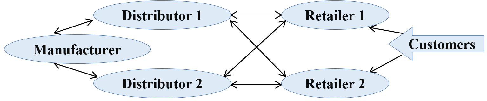
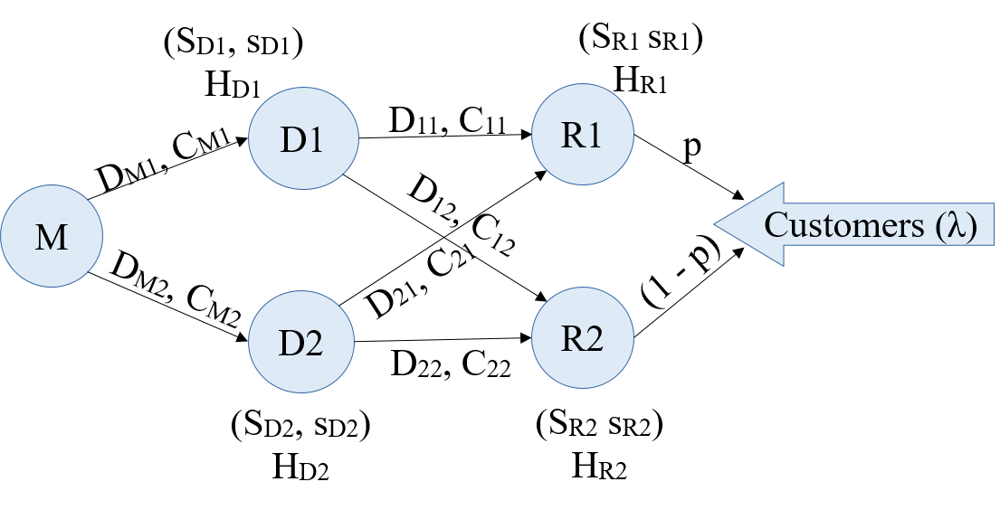

 <h1>Inventory optimization in Supply Chain </h1> 
 

### System Description

Consider a small supply chain, as shown in the figure 1.1 below. The supply chain contains two retailers, two distributors, and a manufacturer.

<figure>

<figcaption>Figure 1.1: Supply Chain Network.</figcaption>
</figure>

__Customer:__

- The arrival of customers to retailers follows a Poisson distribution with an average arrival rate of $\lambda$. A customer purchases between __1 to 10 units__ from the retailer. If requested units are unavailable, the customer will cancel his/her purchase and return. Note that customers can not purchase directly from the distributors.

- A customer, with some probability $p$, will choose any one of the available retailers to buy the product. 

__Retailer:__

- A retailer is directly connected to customers and facilitates product sales in the supply chain. Every retailer maintains an inventory to store product units. The inventory parameters are $(S,s)$. $S$ represents the _capacity_, and $s$ represents the _threshold_ of the inventory. The retailer will place a bulk purchase order with the distributor when the inventory level is low or below a particular threshold $s$. The retailer will only place a subsequent order if its previous order is fulfilled.

- A retailer will choose any one of the connected distributors whose delivery cost is the least to replenish its inventory. If desired units are unavailable at this distributor, the retailer will order from a distributor whose delivery cost is the next least one. If the required number of units of the product is nowhere available, then the retailer will not order. The process for replenishment is repeated on the next day. A retailer makes a profit of $P$ Rs behind every unit sold.

__Distributor:__

- A distributor holds massive units of products and facilitates the distribution of the product to retailers all over a small town. A distributor has its inventory to stock up on the product and provide them to retailers whenever needed. The inventory parameters are $(S,s)$ where $S$ represents capacity and $s$ represents inventory threshold. A distributor will place a bulk order with the manufacturer when the inventory levels fall below $s$. The distributor will only place a subsequent order if its previous order is fulfilled. A distributor charges delivery cost $C$ to the retailer whenever a delivery is made. The delivery is made in $D$ days, depending on the distance from the distributor to the retailer.

- The distributor replenishment policy: 
    1) When the inventory levels are below the threshold $s$
    2) When there are pending requests from any retailer(s), and there is no ongoing order

__Manufacturer:__

- A manufacturer makes the product. In our supply chain system, we have only one manufacturer. We assume that it has an unlimited supply of raw items to make the product. Furthermore, it will always be able to produce and deliver the desired units to distributors. A manufacturer charges delivery cost $C$ to the distributor whenever a delivery is made. The delivery is made in $D$ days, depending on the distance from the manufacturer to the distributor.

__Inventory:__

- A distributor or retailer can have inventory. The inventory has two parameters $(S,s)$ where $S$ represents the capacity and $s$ represents the threshold of the inventory. It has a simple replenishment policy as follows; Inventory levels are monitored every day. The level is recorded at the end of the day, and if it is low (less than threshold $s$), then a bulk order to refill the inventory to level $S$ is placed.

- Furthermore, an inventory holding cost is involved, and it is $H$ Rs per day per item. If $H$ is large, it makes sense to minimize the capacity $S$ of the inventory.

### Nomenclature:

Please refer to figure 1.2.
<figure>
    
<figcaption>Figure 1.2: Supply Chain Network.</figcaption>
</figure>

### Input parameter and values:

- $\lambda = 20 $ 
- $p = 0.5$ (Probability of customer buying from retailer $R_1$)
- $H_{R1} = 10$ (Inventory holding cost for $R_1$)
- $H_{R2} = 10$ 
- $D_{11} = 2$ days, $C_{11} = 5000$ 
- $D_{12} = 3$ days, $C_{12} = 6000$ 
- $D_{21} = 3$ days, $C_{21} = 7000$,
- $D_{22} = 2$ days, $C_{22} = 5500$
- $H_{D1} = 1$ (Inventory holding cost for $D_1$)
- $H_{D2} = 1$ 
- $D_{M1} = 7$ days, $C_{M1} = 500$  
- $D_{M2} = 8$ days, $C_{M2} = 500$ 
- $P = 100$ (profit per item)

#### Design parameters:

|Sr|Parameter|min|max||
| :-: | :-: | -: | :-: | :- |
|1|  SR1 |    100  |    300  |Inventory capacity for R1| 
|2|  sR1 |    100  | SR1 |Inventory threshold for R1|
|3|  SR2 |    100  |    300  |Inventory capacity for R2|
|4|  sR2 |    100  | SR2 |Inventory threshold for R2|
|5|  SD1 | max{ SR1, SR2 } | 600 |Inventory capacity for D1|
|6|  sD1 | max{ SR1, SR2 } | SD1 |Inventory threshold for D1|
|7|  SD2 | max{ SR1, SR2 } | 600 |Inventory capacity for D2|
|8| sD2 | max{ SR1, SR2 } | SD2 |Inventory threshold for D2|

<big>

This notebook file demonstrates the model code for the supply chain network described above. It shows how to create a network, assign parameter values and run the model to evaluate the system's performance measures. It shows the validation steps for the model. A preliminary cost analysis of running the model is also presented here. Please navigate yourself to the cost_accuracy_tradeoff or design_experiments directory. The cost_accuracy_tradeoff module estimates a reasonable computation cost of running the model and evaluating performance measures at a single point in the design space. The design_experiments module sets parameters for exhaustive evaluation (L: length of a simulation run, N: number of simulations) and evaluates the model at a given set of points (with input file in_param.csv)

</big>